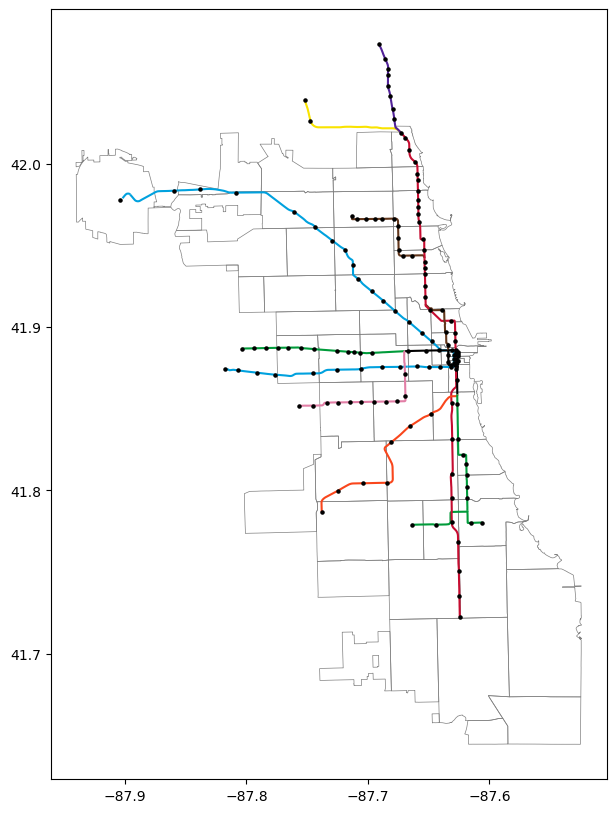
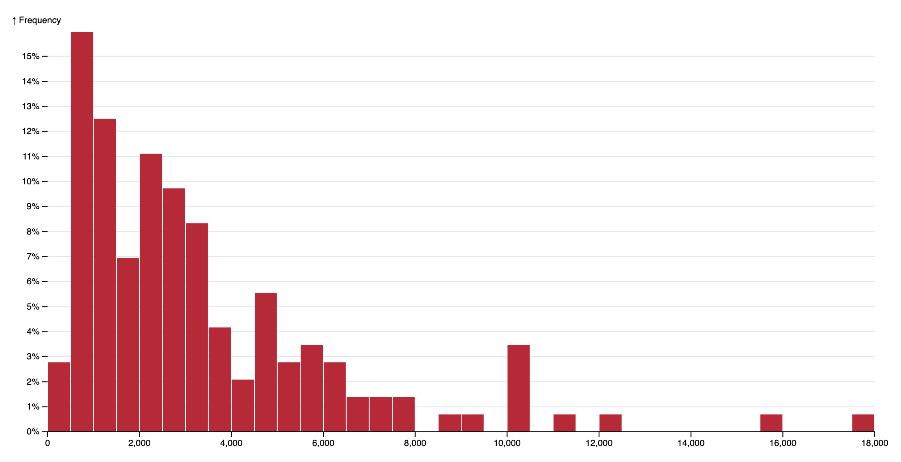

# Chicago 'L' Ridership Data

### CS 424: Project 3

### Adam Beigel and Logan Stein

### 2 December 2022

[Website](https://abeige.github.io/cs424-project3/site/index.html) (There's a lot of data- give it a minute or two to load.)

## The Data

We worked with CTA 'L' ridership data from the city of Chicago's data portal and wanted to analyze how ridership changed over time and with the weather.

### Ridership Data

The ridership data is spatiotemporal and contains the number of rides for each station and day since 2001. It has four columns:

1. `station_id`: integer, five-digit number assigned to each 'L' station
1. `date`: string, date the data was collected
1. `day_type`: character, W=Weekday, A=Saturday, or U=Sunday/Holiday
1. `rides`: integer, number of rides at the station on that date

### 'L' Station Data

Station information for all 'L' stations.

1. `station_id`: integer, five-digit number assigned to each 'L' station
1. `station_name`: string, full name of the station
1. `ada`: boolean, line is ADA accessible 
1. `line`: boolean, several columns; which lines the station services 
1. `longitude`, `latitude`: float, location of the station

### Weather Data

We used monthly average temperatures going back to January 2001 from [weather.gov](https://www.weather.gov/wrh/Climate?wfo=lot) (Monthly Summarized Data, Variable -> Avg temp). It has three columns:

1. `year`: int, 4 digit year
1. `month`: string, 3 letter month
1. `avg_temp`: average temperature for the date in fahrenheit

## Processing

The ridership data did not need much processing, since it's really just the daily ridership information. The 'L' station data had some typos and formatting errors, so we fixed those and kept only the columns we needed.

Then we joined the ridership data with the 'L' station data using the common field `station_id`.

For the weather data, we converted the `year` and `month` fields into a single column, `date`, containing a Date object.

## Data Encoding

Across our visualizations, ridership is encoded as the size of an element. On the map, it will be the area of the circle. On the bar graph, it will be the length of the bar, and on a line graph it will be the y-position of the point.

In addition to ridership, we also have longitude, latitude, and the color of the 'L' line. We use a map to show the position of each station. When applicable, the official CTA colors are used for the line colors.

## Exploration

In order to visualize the data, we used the ZIP Code Boundaries and Rail Line Information datasets. Here you can see each of the 'L' stations plotted on top of these maps:

Another thing to note about the data is that the ridership total is for each *station*, and it is not broken down by line. In order to approximate the number of rides per *line*, we will make the assumption that the rides for a station are equally distributed across all the lines it services. This is not a super accurate number but it gets us close enough to see trends across the different lines.

As a brief statistical analysis of the data, we have a histogram of the frequency of daily ridership totals. We can see that most stations see a daily ridership of between 500 and 3500.

